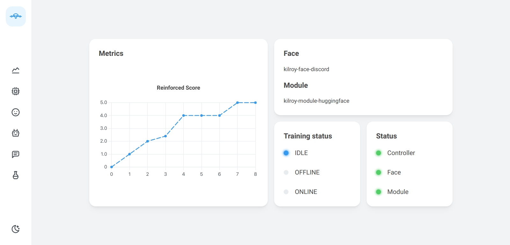

<h1 align="center">kilroyweb</h1>

<div align="center">

kilroy web ui 📉

[](https://github.com/kilroybot/kilroyweb/actions/workflows/test-docker.yaml)
[](https://github.com/kilroybot/kilroyweb/actions/workflows/docs.yaml)

</div>

---

## Overview

kilroyweb is a web ui for **kilroy**.
It is a
[Next.js](https://nextjs.org)
app that uses
[Mantine](https://mantine.dev)
for styling.




## Running

With [`npm`](https://www.npmjs.com) and [`node`](https://nodejs.org) installed,
run:

```bash
npm install
npm run start
```

The app will be available at `http://localhost:14000`.
